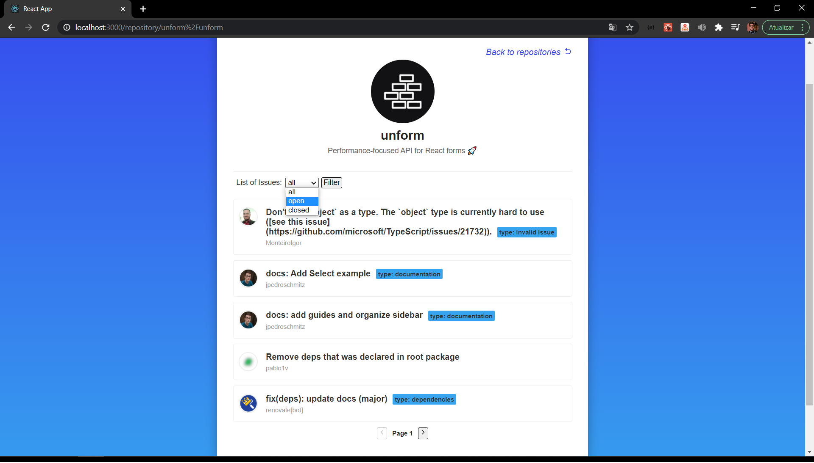

<h1 align="center">
    
</h1>


<h4 align="center">
  A platform for researching the problem using the github platform.
</h4>

<p align="center">
  <a href="#rocket-technologies">Technologies</a>&nbsp;&nbsp;&nbsp;|&nbsp;&nbsp;&nbsp;
  <a href="#information_source-how-to-use">How To Use</a>&nbsp;&nbsp;&nbsp;|&nbsp;&nbsp;&nbsp;
  <a href="#sunny-result">Result</a>
</p>


## :rocket: Technologies

This project was developed with the following technologies:

- [ReactJS](https://reactjs.org/)
- [styled-components](https://www.styled-components.com/)
- [Axios](https://www.styled-components.com/)
- [Class Componetns](https://pt-br.reactjs.org/docs/react-component.html)
- [Deafult Props & PropTypes](https://pt-br.reactjs.org/docs/typechecking-with-proptypes.html)
- [react-icons](https://react-icons.github.io/react-icons/)
- [VS Code][vc] with [EditorConfig][vceditconfig] and [ESLint][vceslint]


## :information_source: How To Use

To clone and run this application, you'll need [Git](https://git-scm.com), [Node.js v12.18.4][nodejs] or higher + [Yarn v1.22][yarn] or higher installed on your computer. From your command line:

```bash
# Clone this repository
$ git clone https://github.com/Ivo-Jr/github-queries.git

# Go into the repository
$ cd github-queries

# Install dependencies
$ yarn or npm install

# Run the app
$ yarn or npm start
```


```

## :sunny: Result

  <div style="display: flex;   flex-direction: column;
  align-items: center;">
  <h1 align="center" style="display: flex; flex-direction:row;">
      
       <br>
       <br>
       <br>
      
      <br>
      <br>
      <br>
      
      <br>
      <br>
      <br>
      
  </h1>     
  </div>

---

Made with ♥ by Ivo Junior :wave: [Get in touch!](https://www.linkedin.com/in/jos%C3%A9-ivo-maciel-j%C3%BAnior-658136145/)

[React]: https://pt-br.reactjs.org/
[yarn]: https://yarnpkg.com/
[vc]: https://code.visualstudio.com/

